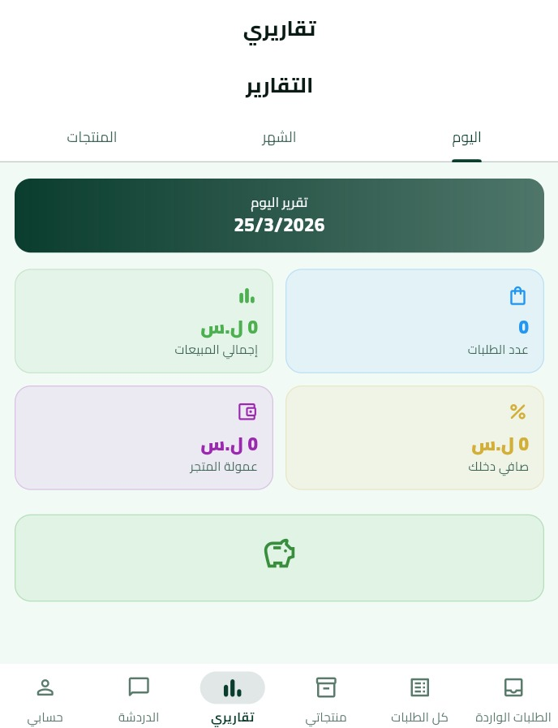
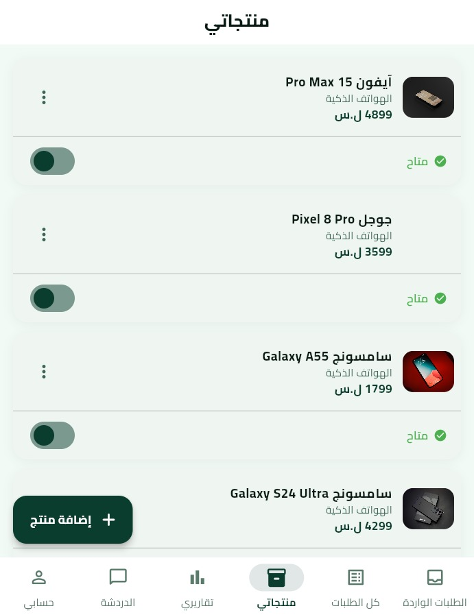
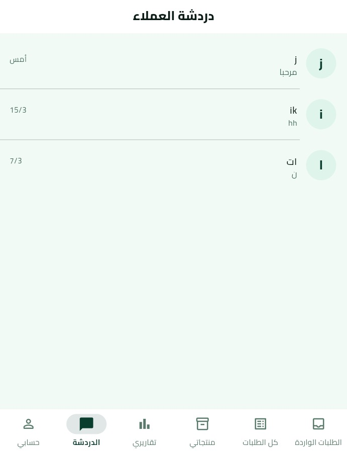
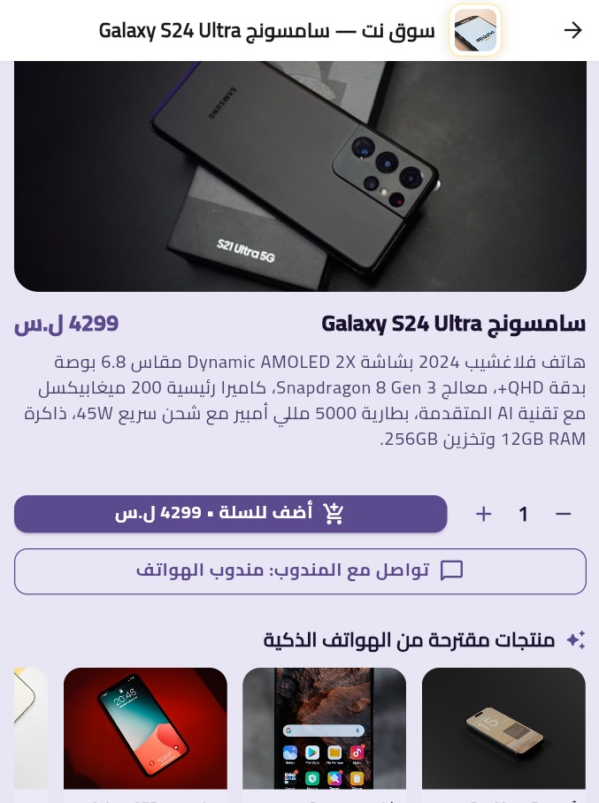
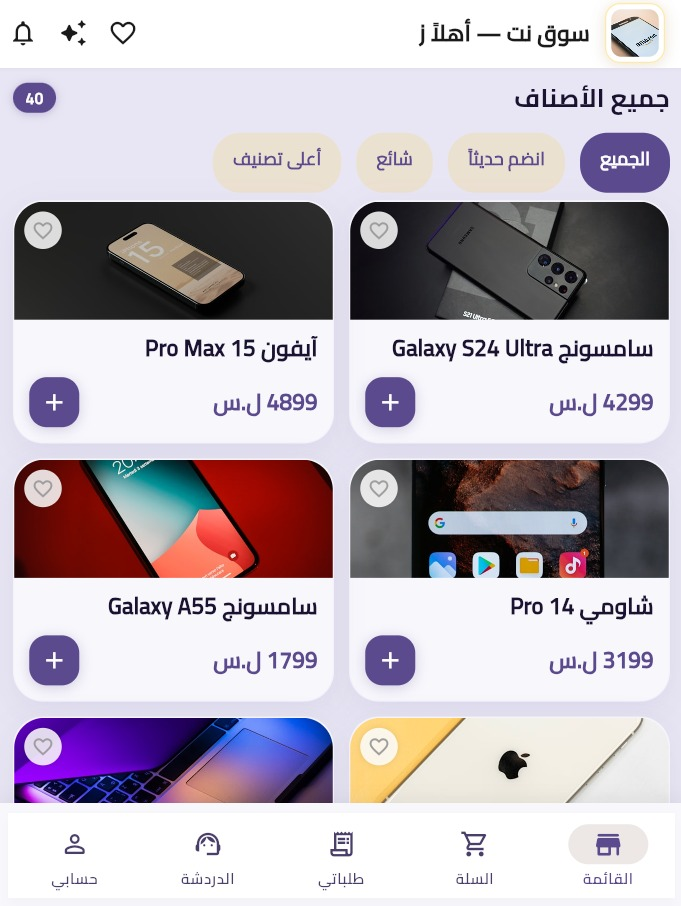
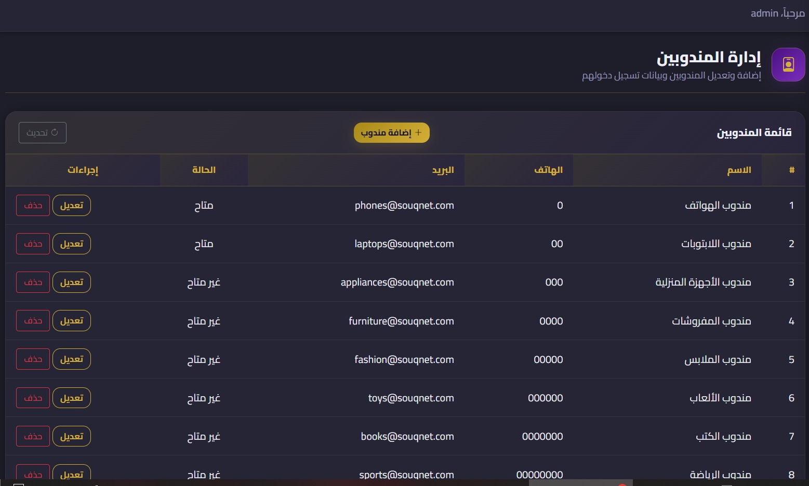
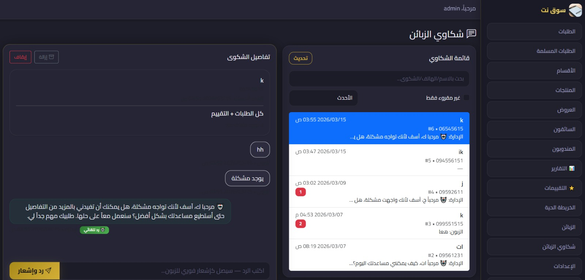
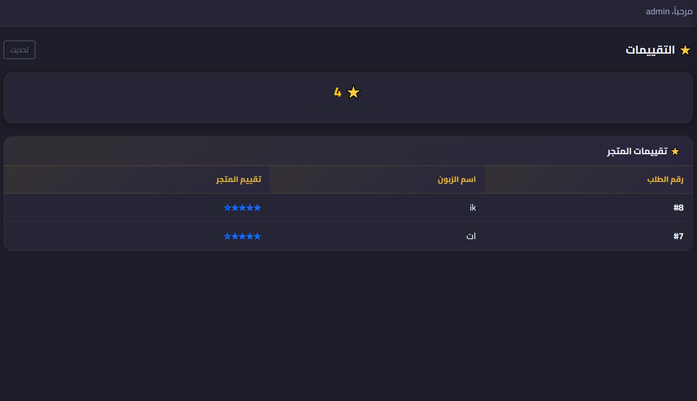

<div align="center">

# 🛒 Souq Net — Smart E-Commerce Platform
### منصة التجارة الإلكترونية الذكية

[](https://flutter.dev)
[](https://dotnet.microsoft.com)
[](https://mysql.com)
[](https://firebase.google.com)
[](https://openai.com)
[](https://docker.com)

---

*A full-stack, AI-powered multi-vendor e-commerce platform with smart shopping assistant, real-time delivery tracking, and a complete seller management ecosystem.*

*منصة تجارة إلكترونية متعددة البائعين مدعومة بالذكاء الاصطناعي — مع مساعد تسوق ذكي وتتبع توصيل لحظي ونظام إدارة متكامل للمندوبين.*

</div>

---

## 📋 Table of Contents / فهرس المحتويات

- [Overview](#-overview--نظرة-عامة)
- [What Makes It Different](#-what-makes-it-different--ما-يميز-هذا-المشروع)
- [System Architecture](#-system-architecture--البنية-التقنية)
- [Screenshots](#-screenshots--لقطات-الشاشة)
- [Tech Stack](#-tech-stack--التقنيات-المستخدمة)
- [Features by Module](#-features-by-module--ميزات-كل-وحدة)
- [Project Structure](#-project-structure--هيكل-المشروع)
- [How It Works](#-how-it-works--آلية-العمل)
- [Advanced Technical Features](#-advanced-technical-features--الميزات-التقنية-المتقدمة)

---

## 🌟 Overview / نظرة عامة

**Souq Net** is a production-ready multi-vendor e-commerce platform that connects customers, product agents, delivery drivers, and store admins in a single integrated ecosystem. The platform features an **AI-powered shopping assistant** that helps customers compare products, get recommendations, and make informed purchase decisions.

**سوق نت** هو منصة تجارة إلكترونية متعددة البائعين جاهزة للإنتاج — تربط الزبائن والمندوبين وسائقي التوصيل ومدراء المتجر في منظومة متكاملة. تتميز المنصة بـ **مساعد تسوق مدعوم بالذكاء الاصطناعي** يساعد الزبائن في مقارنة المنتجات والحصول على توصيات ذكية.

| Module | Technology | Role |
|--------|-----------|------|
| 📱 Customer App | Flutter / Android | Browse, buy, track, AI chat |
| 🏪 Agent App | Flutter / Android | Manage products, orders & sales |
| 🚗 Driver App | Flutter / Android | Receive & deliver orders with GPS |
| 🌐 Web Dashboard | ASP.NET Core | Full platform control panel |

---

## ✨ What Makes It Different / ما يميز هذا المشروع

| Feature | Description |
|---------|-------------|
| 🤖 **AI Shopping Assistant** | Built-in chatbot powered by AI — helps customers find products, compare specs, and answer any question about the catalog |
| 🏪 **Multi-Agent / Multi-Vendor** | Each agent manages their own product category with dedicated orders, chat, and reports |
| ⭐ **Dual Rating System** | Customers rate both the store and individual products separately |
| 💛 **Favorites & Wishlist** | Customers can save products to a personal favorites list |
| 🤖 **AI Auto-Reply** | Configurable AI auto-response for customer complaints and chat messages |
| 💰 **Commission System** | Automated commission tracking per agent with detailed reporting |
| 📦 **Stock Management** | Real-time stock tracking per product with availability control |

---

## 🏗️ System Architecture / البنية التقنية

```
┌──────────────────────────────────────────────────────────────┐
│                        CLIENT LAYER                          │
│  ┌──────────────┐  ┌──────────────┐  ┌──────────────┐      │
│  │ Customer App │  │  Agent App   │  │  Driver App  │      │
│  │  (Flutter)   │  │  (Flutter)   │  │  (Flutter)   │      │
│  └──────┬───────┘  └──────┬───────┘  └──────┬───────┘      │
└─────────┼────────────────┼────────────────┼───────────────┘
          │                │                │
          ▼                ▼                ▼
┌──────────────────────────────────────────────────────────────┐
│              API + DASHBOARD LAYER                           │
│          ASP.NET Core 8 — RESTful API + Razor Pages          │
│          JWT · SignalR · FCM · AI Proxy · Commission Engine  │
└──────────────────────┬───────────────────────────────────────┘
                       │
          ┌────────────┼────────────┐
          ▼            ▼            ▼
     ┌─────────┐  ┌─────────┐  ┌──────────┐
     │  MySQL  │  │Firebase │  │  OpenAI  │
     │   DB    │  │Auth+FCM │  │ AI Proxy │
     └─────────┘  └─────────┘  └──────────┘
```

---

## 📸 Screenshots / لقطات الشاشة

### 📱 Customer App — تطبيق الزبائن

<table>
<tr>
<td align="center"><br/><b>AI Shopping Assistant</b><br/>المساعد الذكي للتسوق</td>
<td align="center"><br/><b>Sales Reports</b><br/>تقارير المبيعات</td>
<td align="center"><br/><b>Product Catalog</b><br/>قائمة المنتجات</td>
</tr>
</table>

### 🏪 Agent App — تطبيق المندوبين

<table>
<tr>
<td align="center"><br/><b>Customer Chats</b><br/>دردشة العملاء</td>
<td align="center"><br/><b>My Products</b><br/>منتجاتي</td>
<td align="center"><br/><b>Product Detail + Agent Chat</b><br/>تفاصيل المنتج + التواصل مع المندوب</td>
</tr>
</table>

### 🌐 Web Dashboard — لوحة التحكم

<table>
<tr>
<td align="center"><br/><b>Agents Management</b><br/>إدارة المندوبين</td>
<td align="center"><br/><b>Customer Complaints + AI Auto-Reply</b><br/> شكاوي الزبائن مع الرد التلقائي الذكي </td>
</tr>
<tr>
<td align="center" colspan="2"><br/><b>Ratings & Reviews</b><br/>التقييمات</td>
</tr>
</table>

---

## ⚙️ Tech Stack / التقنيات المستخدمة

### 📱 Mobile Apps
| Technology | Purpose |
|-----------|---------|
| **Flutter** (Dart) | Cross-platform mobile development |
| **Firebase Authentication** | Customer login & identity |
| **Firebase Cloud Messaging (FCM)** | Push notifications |
| **Google Maps API** | Location picking & delivery tracking |
| **SignalR Client** | Real-time order and chat updates |
| **Foreground Service** | Continuous GPS broadcasting (Driver App) |

### 🌐 Backend & Dashboard
| Technology | Purpose |
|-----------|---------|
| **ASP.NET Core 8** | REST API + Razor Pages admin dashboard |
| **Entity Framework Core** | ORM & database migrations |
| **SignalR Hubs** | Real-time notifications & tracking |
| **JWT Authentication** | Secure token-based API access |
| **Firebase Admin SDK** | Server-side push notifications |
| **AI Proxy Controller** | Routes requests to OpenAI for smart features |
| **Docker + Docker Compose** | Containerized production deployment |

### 🗄️ Database
| Technology | Purpose |
|-----------|---------|
| **MySQL 8** | Primary relational database |
| **EF Core Migrations** | Version-controlled schema management |
| **Transactions** | Data integrity across multi-step operations |

---

## 🔧 Features by Module / ميزات كل وحدة

### 👤 Customer App

| Feature | Details |
|---------|---------|
| 🔐 Authentication | Firebase Auth — email/password + Google Sign-In |
| 🛍️ Product Catalog | Browse by category, filter by newest / most popular / top rated |
| 🔍 Smart Search | Search across all products instantly |
| 💛 Favorites / Wishlist | Save products to a personal favorites list |
| 🤖 AI Shopping Assistant | Chat with an AI that knows the full product catalog — compare, recommend, answer questions |
| 💬 Agent Direct Chat | Message the product agent directly from the product page |
| 🛒 Smart Cart | Add products, set quantity, view total with delivery cost |
| 📍 Delivery Tracking | Real-time order status + live driver location on map |
| ⭐ Rating System | Rate the store and rate each product individually |
| 📣 Complaints | Submit complaints with full order history context |
| 🔔 Push Notifications | Order updates, offers, chat messages |
| 🌙 Dark Mode | Manual or system-synced dark theme |

### 🏪 Agent App

| Feature | Details |
|---------|---------|
| 🔐 Secure Login | Credentials created by admin only |
| 📦 Product Management | Add, edit, delete products — toggle availability per item |
| 📬 Incoming Orders | Real-time incoming orders for the agent's category |
| 📋 All Orders | Full order history with status tracking |
| 💬 Customer Chat | Direct messaging with customers about their orders |
| ⭐ Product Ratings | View ratings and reviews per product |
| 📊 Sales Reports | Daily / monthly revenue, order count, commissions earned |
| 💰 Commission Tracking | Detailed breakdown of earned commissions |

### 🚗 Driver App

| Feature | Details |
|---------|---------|
| 🔐 Admin-created accounts | No self-registration |
| 📲 Instant Order Alerts | FCM push notification on new assignment |
| 🗺️ Order + Customer Location | Full order detail with map destination |
| 🔄 Order Lifecycle | Accept → Start Delivery → Confirm Delivery |
| 📡 Live GPS Broadcast | Location sent every few seconds via foreground service |
| 📊 Daily Stats | Deliveries completed, earnings, active orders |
| 🌙 Dark Mode | Optimized for night driving |

### 🌐 Web Dashboard

#### 🛍️ Product & Catalog Management
- Add / edit / delete products with image upload and stock control
- Category management with icons and images
- Create promotions and limited-time discount offers

#### 🏪 Agent (Vendor) Management
- Create agent accounts with category assignment
- Edit agent data and access credentials
- Enable / disable agent accounts
- Commission rate configuration per agent

#### 💰 Commission System
- Track commissions per agent automatically
- View commission reports by period
- Adjust commission percentages

#### 🚚 Order Management
- View all orders across all agents
- Filter by day / week / month
- Assign drivers, set delivery time estimates
- Full order lifecycle management

#### 🚗 Driver Management
- Create and manage driver accounts
- Enable / disable drivers

#### 📍 Live Map
- Real-time map of all active drivers
- Active delivery tracking overlay

#### 💬 Complaints & Chat
- View all customer complaints with full context
- **🤖 AI Auto-Reply** — when enabled, the system automatically generates a context-aware reply to every new complaint using AI, without any manual intervention
- Manual reply always available with instant push notification to customer
- Archive / suspend complaint feature

#### ⭐ Ratings & Reviews
- Store-level ratings dashboard
- Per-product ratings and customer reviews
- Overall rating score display

#### 📊 Reports & Analytics
- Total sales, order count, average order value
- Per-agent revenue and commission reports
- Best-selling products and categories
- Customer satisfaction ratings overview

#### ⚙️ Store Settings
- Store name, logo, colors — synced to all apps via API
- Open / close store with custom closed-screen message
- Delivery pricing per km configuration
- AI assistant settings — enable/disable, configure auto-reply behavior

---

## 📁 Project Structure / هيكل المشروع

```
Smart online store/
├── AdminDashboard/                     # ASP.NET Core 8 — Backend + Web Dashboard
│   ├── Controllers/                    # REST API Controllers
│   │   ├── CustomerController.cs       # Customer endpoints
│   │   ├── AgentController.cs          # Agent (vendor) endpoints
│   │   ├── AgentOrderController.cs     # Agent order management
│   │   ├── DriverController.cs         # Driver endpoints
│   │   ├── AdminController.cs          # Admin management
│   │   ├── PublicController.cs         # Public catalog & settings API
│   │   ├── AiProxyController.cs        # AI shopping assistant proxy
│   │   ├── CustomerProductChatController.cs  # Customer ↔ Agent chat
│   │   ├── AdminCommissionsController.cs     # Commission management
│   │   ├── RatingsController.cs        # Ratings & product reviews
│   │   └── FcmController.cs            # Push notifications
│   │
│   ├── Entities/                       # Database Models
│   │   ├── Orders.cs
│   │   ├── Customer.cs
│   │   ├── Agent.cs
│   │   ├── AgentEntities.cs
│   │   ├── Driver.cs
│   │   ├── Menu.cs
│   │   ├── Promotions.cs
│   │   ├── StoreSettings.cs
│   │   ├── TrackingAndFeedback.cs
│   │   └── Notifications.cs
│   │
│   ├── Hubs/                           # SignalR Real-Time
│   │   ├── TrackingHub.cs              # Live GPS tracking
│   │   └── NotifyHub.cs                # Order & chat notifications
│   │
│   ├── Services/
│   │   ├── FcmService.cs               # Firebase push notifications
│   │   └── AgentOrderAutoAcceptService.cs  # Background auto-accept service
│   │
│   ├── Security/                       # Multi-role Authentication
│   │   ├── AdminAuth.cs
│   │   ├── AgentAuth.cs
│   │   ├── DriverAuth.cs
│   │   ├── CustomerAuthAttribute.cs
│   │   └── AdminApiKeyAttribute.cs
│   │
│   ├── Pages/Admin/                    # Razor Pages Dashboard UI
│   │   ├── Products.cshtml
│   │   ├── Agents.cshtml
│   │   ├── Orders.cshtml
│   │   ├── Drivers.cshtml
│   │   ├── LiveMap.cshtml
│   │   ├── Reports.cshtml
│   │   ├── Ratings.cshtml
│   │   ├── Complaints.cshtml
│   │   ├── Commissions.cshtml
│   │   ├── Customers.cshtml
│   │   └── Settings.cshtml
│   │
│   ├── Migrations/                     # EF Core DB Migrations
│   ├── Dockerfile
│   └── docker-compose.yml
│
└── apps/
    ├── customer_app/                   # Flutter — Customer Mobile App
    │   └── lib/
    │       ├── screens/                # home, catalog, product, cart, AI chat, agent chat...
    │       ├── services/               # API, push, realtime, firebase
    │       ├── widgets/                # Premium UI components
    │       └── theme/                  # Dynamic theme from API
    │
    ├── agent_app/                      # Flutter — Agent (Vendor) Mobile App
    │   └── lib/
    │       ├── screens/                # products, orders, chat, reports, profile
    │       └── services/               # Agent API, realtime
    │
    └── driver_app/                     # Flutter — Driver Mobile App
        └── lib/
            ├── screens/                # Order detail, home, login
            └── services/               # GPS foreground service, location sender
```

---

## 🔄 How It Works / آلية العمل

```
 1. Customer browses product catalog (filtered by category, ratings, popularity)
        ↓
 2. Customer chats with AI assistant for product recommendations
        ↓
 3. Customer views product detail → can chat directly with agent
        ↓
 4. Customer adds to cart → places order with delivery address
        ↓
 5. Agent receives order notification instantly
        ↓
 6. Agent confirms order → admin assigns driver
        ↓
 7. Driver receives push notification → starts delivery
        ↓
 8. GPS tracking begins → customer sees driver live on map
        ↓
 9. Driver confirms delivery → order complete
        ↓
10. Customer rates the store + rates the product
        ↓
11. Commission calculated automatically for the agent
        ↓
12. All data feeds into reports & analytics
```

---

## 🚀 Advanced Technical Features / الميزات التقنية المتقدمة

| Feature | Implementation |
|---------|---------------|
| **AI Shopping Assistant** | `AiProxyController` routes requests to OpenAI with full product catalog context — answers product questions, makes comparisons, gives recommendations |
| **AI Auto-Reply for Complaints** | Configurable from dashboard — AI automatically responds to new customer complaints with context-aware messages |
| **Multi-Vendor Architecture** | Each agent has isolated product catalog, order queue, chat inbox, and commission report |
| **Real-Time GPS Tracking** | Flutter foreground service → SignalR `TrackingHub` → all connected clients updated instantly |
| **Commission Engine** | Automatic commission calculation per order per agent with configurable rates |
| **Stock Management** | Per-product stock tracking — admin and agents can toggle availability in real time |
| **Dual Rating System** | Separate ratings for store-level satisfaction and individual product quality |
| **Favorites / Wishlist** | Customer-specific product favorites stored server-side |
| **Agent Auto-Accept Service** | Background service that can automatically accept incoming orders for agents |
| **Multi-Role JWT Auth** | Separate auth layers: Firebase (customers) · JWT (agents + drivers) · AdminKey (admin panel) |
| **Docker Deployment** | Full containerized backend with `docker-compose.yml` |
| **Brand-Aware Apps** | All apps fetch logo, colors, and settings from API on launch — fully customizable from dashboard |

---

<div align="center">

**Built with Flutter · ASP.NET Core 8 · MySQL · Firebase · OpenAI**

</div>
